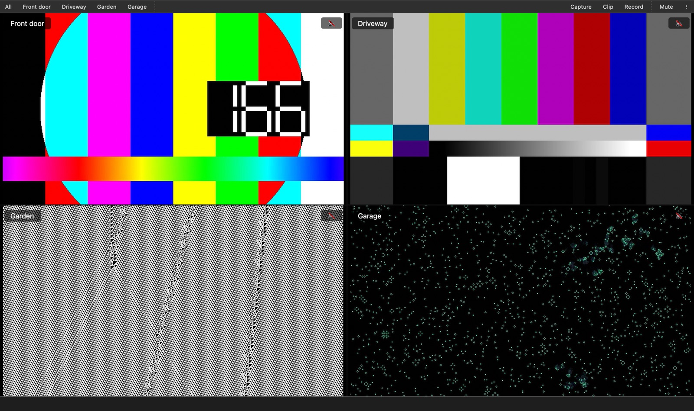

# Striem

Watch your RTSP cameras side by side on Linux, and save a frame, the last 30 seconds or a recording with one key.



## Install

Striem is a Flatpak, so it runs on any Linux with Flatpak (Bazzite, Fedora, Ubuntu…):

```sh
curl -LO https://github.com/alen-androsevic/striem/releases/latest/download/striem.flatpak
flatpak install --user striem.flatpak
```

Open it from your app menu. To update, download and install the newest file the same way.

Want fixes before they're released? Install the [nightly build](https://github.com/alen-androsevic/striem/releases/tag/nightly-rolling) instead — each replaces the other.

## Use

**Add cameras.** Put a `.xspf` playlist in `~/Videos/Cameras` for each camera. VLC can save one, or write it by hand:

```xml
<playlist version="1" xmlns="http://xspf.org/ns/0/">
  <trackList>
    <track><title>Front door</title><location>rtsp://192.168.1.20/stream</location></track>
  </trackList>
</playlist>
```

Striem notices new, changed and removed playlists while it runs.

**Watch.**

| Key | Does |
|---|---|
| `1`–`9` or click | Focus a camera |
| `Esc` or `0` | Back to the grid |
| `M` | Mute |
| `F11` | Fullscreen |

**Save.** Each key saves the focused camera, or every camera when you're in the grid. Files go to `~/Videos/Striem`.

| Key | Saves |
|---|---|
| `S` | The current frame, as `.png` |
| `C` | The last 30 seconds, as `.mkv` — Striem keeps them buffered |
| `R` | A recording, until you press `R` again |

The **⋮** menu changes the folders and the clip length. `flatpak run io.github.striem.Striem --help` prints this reference.

## Contribute

Bug reports and pull requests are welcome. You'll need libmpv (`brew install mpv`, or your distro's `mpv` package), then:

```sh
git clone https://github.com/alen-androsevic/striem && cd striem
python3 -m venv .venv && .venv/bin/pip install -e '.[dev]'
.venv/bin/python -m pytest
```

[CONTRIBUTING.md](CONTRIBUTING.md) covers fake cameras for testing, branches and releases.

## License

[GPL-3.0-or-later](LICENSE)
